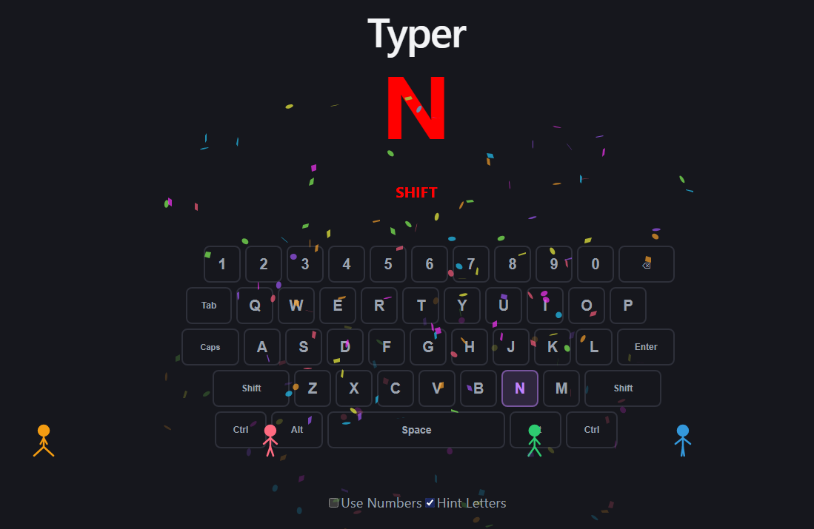

# Typer

A typing practice game built with React and Vite.




## Features

- On-screen QWERTY keyboard with number row and control keys
- Visual highlighting of the target letter and wrong-key feedback in red
- Confetti burst on each correct press
- Spaced repetition: struggling letters appear more often, known ones are spaced out
- Walking people animation — a little character drops from each correctly pressed key and joins a crowd walking across the keyboard
- Toggle numbers on/off to include digits in the rotation

## Getting Started

```sh
npm install
npm run dev
```

## Commands

| Command | Description |
|---------|-------------|
| `npm run dev` | Start dev server |
| `npm run build` | Build for production |
| `npm run lint` | Run ESLint |
| `npm run preview` | Preview production build |
